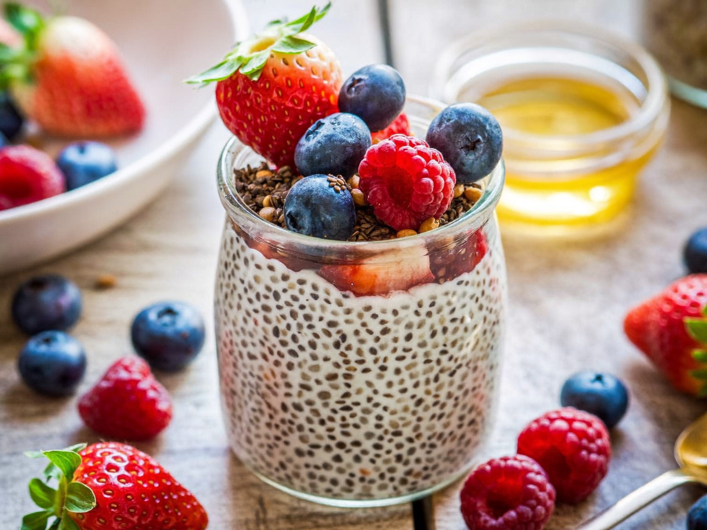
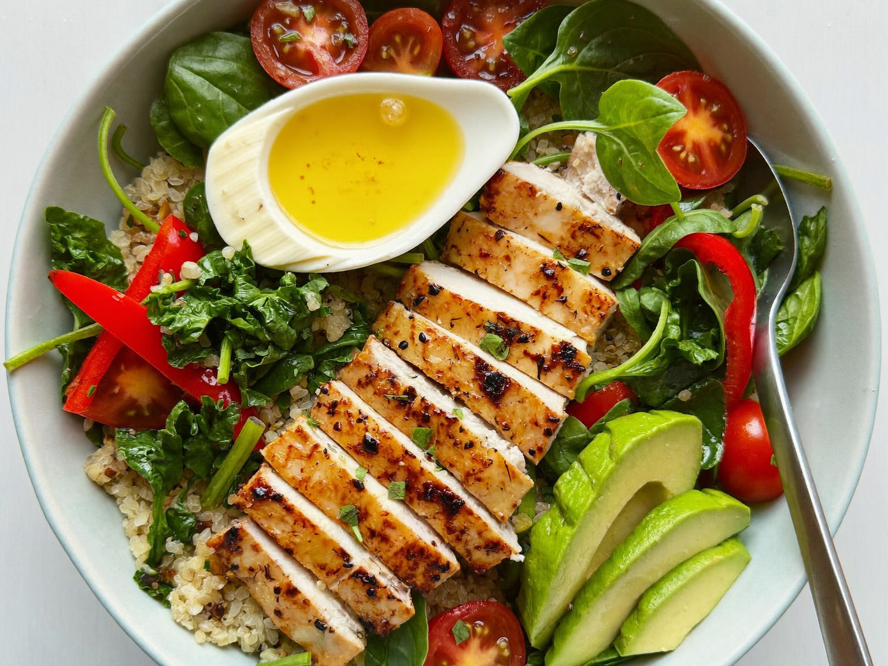
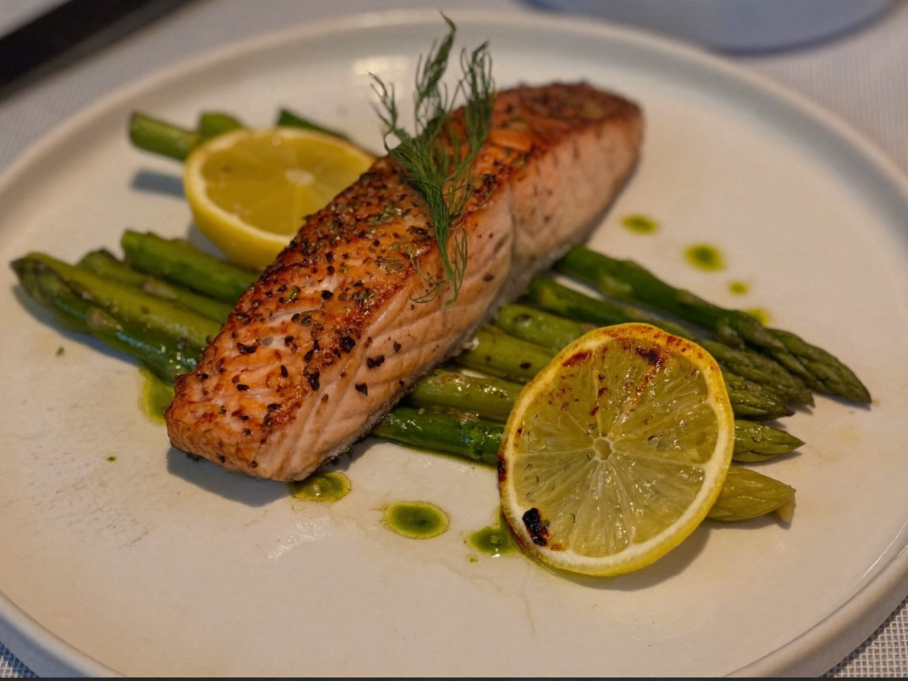
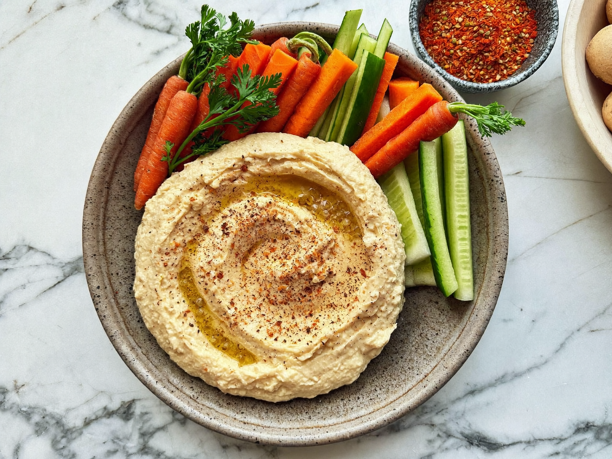
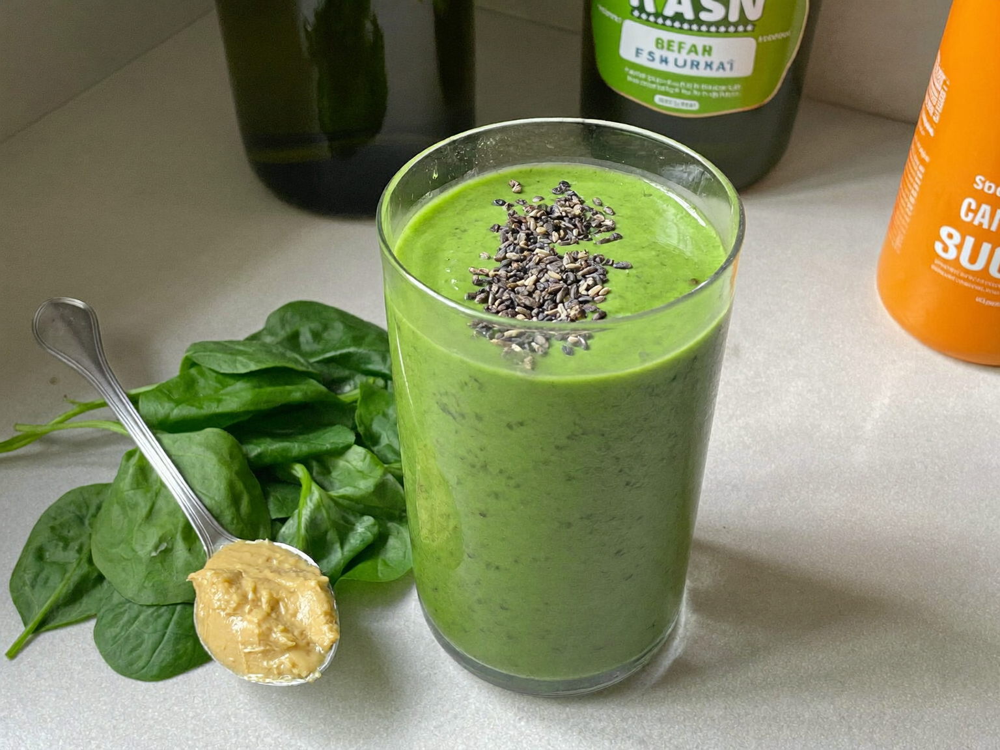

# 365 Recetas Saludables — Una receta para cada día
### Con conteo de calorías y macros en cada receta

> Muestra: Recetas 1 a 5

---

## Receta 001 — Avena Overnight con Frutos Rojos y Chía

**Categoría:** Desayuno · **Porciones:** 1 · **Preparación:** 5 min (+ reposo nocturno) · **Dificultad:** Fácil

**🔥 Calorías: 320 kcal por porción**

**Ingredientes**
- ½ taza de avena en hojuelas (40 g)
- ¾ taza de leche descremada o bebida de almendras (180 ml)
- 1 cucharada de semillas de chía (12 g)
- ½ taza de frutos rojos mixtos (fresas, arándanos, frambuesas) (75 g)
- 1 cucharadita de miel o sirope sin azúcar (opcional)
- Una pizca de canela

**Preparación**
1. En un frasco de vidrio, mezcla la avena, la leche, la chía y la canela.
2. Remueve bien para que la chía no se apelmace.
3. Tapa y refrigera mínimo 6 horas (idealmente toda la noche).
4. Por la mañana, remueve, añade los frutos rojos por encima y la miel si la usas.

**Información nutricional (por porción)**
- Calorías: **320 kcal** · Proteína: 14 g · Carbohidratos: 48 g · Grasas: 9 g · Fibra: 11 g

**💡 Tip saludable:** Prepara 3 frascos a la vez para tener desayunos listos toda la semana. La fibra de la chía y la avena te mantiene saciado hasta el mediodía.

---

## Receta 002 — Bowl de Pollo a la Plancha con Quinoa y Aguacate

**Categoría:** Almuerzo · **Porciones:** 1 · **Preparación:** 25 min · **Dificultad:** Media

**🔥 Calorías: 480 kcal por porción**

**Ingredientes**
- 120 g de pechuga de pollo
- ½ taza de quinoa cocida (90 g)
- ¼ de aguacate (35 g)
- 1 taza de espinacas frescas (30 g)
- ½ pimiento rojo en tiras (60 g)
- 5 tomates cherry
- 1 cucharada de aceite de oliva
- Jugo de ½ limón, sal y pimienta

**Preparación**
1. Sazona el pollo con sal, pimienta y un chorrito de limón. Cocínalo a la plancha 5–6 min por lado hasta dorar.
2. Cocina la quinoa según el paquete (o usa la que ya tengas lista) y déjala templar.
3. En un bowl, coloca la base de espinacas, encima la quinoa, el pimiento y los tomates.
4. Corta el pollo en tiras y el aguacate en láminas. Distribúyelos por encima.
5. Aliña con aceite de oliva, limón, sal y pimienta.

**Información nutricional (por porción)**
- Calorías: **480 kcal** · Proteína: 38 g · Carbohidratos: 35 g · Grasas: 19 g · Fibra: 8 g

**💡 Tip saludable:** El pollo + quinoa aporta proteína completa. Ideal post-entreno para recuperación muscular.

---

## Receta 003 — Salmón al Horno con Espárragos y Limón

**Categoría:** Cena · **Porciones:** 1 · **Preparación:** 20 min · **Dificultad:** Fácil

**🔥 Calorías: 410 kcal por porción**

**Ingredientes**
- 130 g de filete de salmón
- 8 espárragos verdes
- 1 cucharada de aceite de oliva
- ½ limón en rodajas
- 1 diente de ajo picado
- Eneldo fresco (o seco), sal y pimienta

**Preparación**
1. Precalienta el horno a 200 °C.
2. Coloca el salmón y los espárragos sobre papel de hornear.
3. Rocía con aceite de oliva, ajo, sal, pimienta y eneldo. Pon las rodajas de limón encima.
4. Hornea 12–15 min hasta que el salmón se desmenuce fácilmente con un tenedor.

**Información nutricional (por porción)**
- Calorías: **410 kcal** · Proteína: 34 g · Carbohidratos: 8 g · Grasas: 27 g · Fibra: 4 g

**💡 Tip saludable:** El salmón es rico en omega-3, que cuida tu corazón y reduce la inflamación. Cena ligera y saciante.

---

## Receta 004 — Hummus Casero con Crudités

**Categoría:** Snack · **Porciones:** 4 · **Preparación:** 10 min · **Dificultad:** Fácil

**🔥 Calorías: 190 kcal por porción**

**Ingredientes**
- 1 lata de garbanzos cocidos, escurridos (240 g)
- 2 cucharadas de tahini
- Jugo de 1 limón
- 1 diente de ajo
- 2 cucharadas de aceite de oliva
- ½ cucharadita de comino, sal al gusto
- 3–4 cucharadas de agua fría
- Para acompañar: bastones de zanahoria, apio y pepino

**Preparación**
1. En una procesadora, tritura los garbanzos, el tahini, el limón, el ajo, el comino y la sal.
2. Añade el aceite de oliva y el agua poco a poco hasta lograr una textura cremosa.
3. Sirve en un bol, decora con un hilo de aceite y pimentón.
4. Acompaña con los bastones de verdura crujiente.

**Información nutricional (por porción)**
- Calorías: **190 kcal** · Proteína: 7 g · Carbohidratos: 16 g · Grasas: 11 g · Fibra: 5 g

**💡 Tip saludable:** Snack vegano y rico en fibra que frena los antojos. Se conserva 4 días en la nevera.

---

## Receta 005 — Smoothie Verde Proteico

**Categoría:** Bebida / Desayuno rápido · **Porciones:** 1 · **Preparación:** 5 min · **Dificultad:** Fácil

**🔥 Calorías: 250 kcal por porción**

**Ingredientes**
- 1 taza de espinacas frescas (30 g)
- ½ plátano congelado (60 g)
- 1 scoop de proteína de vainilla (30 g) o ¾ taza de yogur griego natural
- ¾ taza de bebida de almendras sin azúcar (180 ml)
- 1 cucharada de mantequilla de almendras
- ½ taza de hielo

**Preparación**
1. Coloca todos los ingredientes en la licuadora.
2. Licúa 45–60 segundos hasta que quede totalmente cremoso.
3. Sirve de inmediato en un vaso alto.

**Información nutricional (por porción)**
- Calorías: **250 kcal** · Proteína: 28 g · Carbohidratos: 22 g · Grasas: 8 g · Fibra: 5 g

**💡 Tip saludable:** Desayuno o merienda en 5 minutos. La espinaca casi no se nota en sabor pero suma hierro y vitaminas.

---

### 📊 Resumen de la muestra
| # | Receta | Categoría | Calorías |
|---|--------|-----------|----------|
| 001 | Avena Overnight con Frutos Rojos | Desayuno | 320 kcal |
| 002 | Bowl de Pollo con Quinoa y Aguacate | Almuerzo | 480 kcal |
| 003 | Salmón al Horno con Espárragos | Cena | 410 kcal |
| 004 | Hummus Casero con Crudités | Snack | 190 kcal |
| 005 | Smoothie Verde Proteico | Bebida | 250 kcal |
